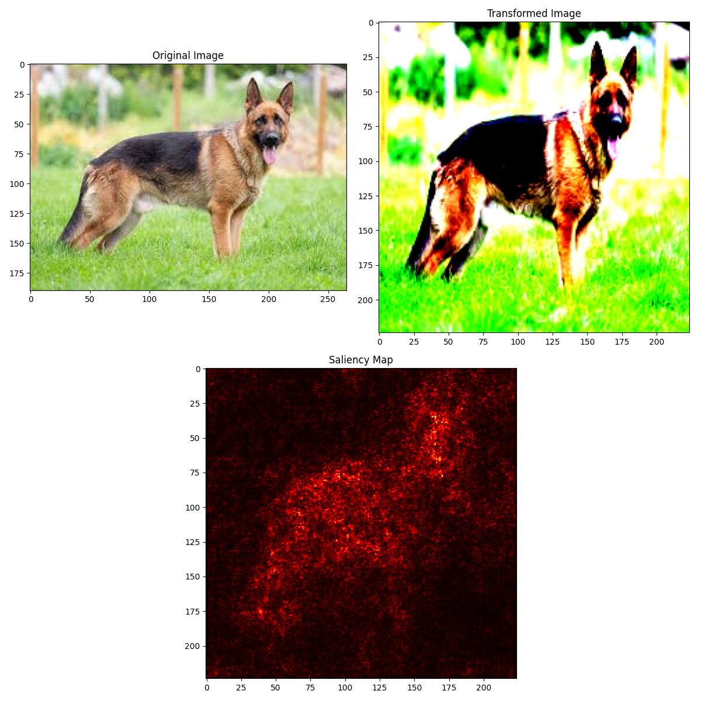
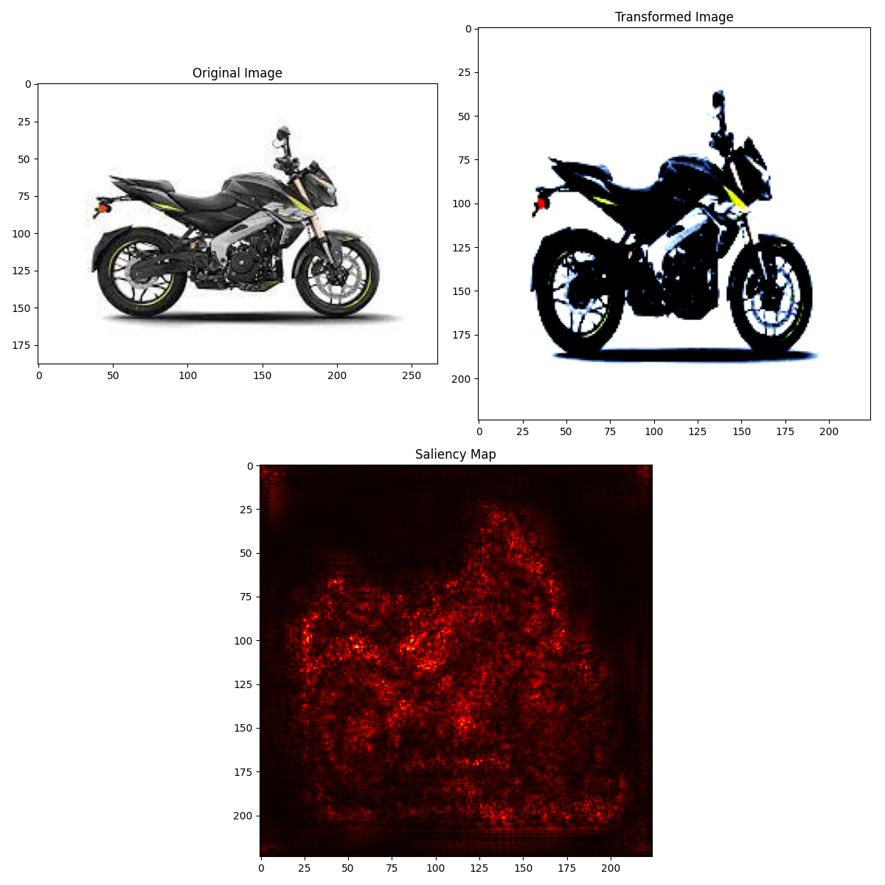
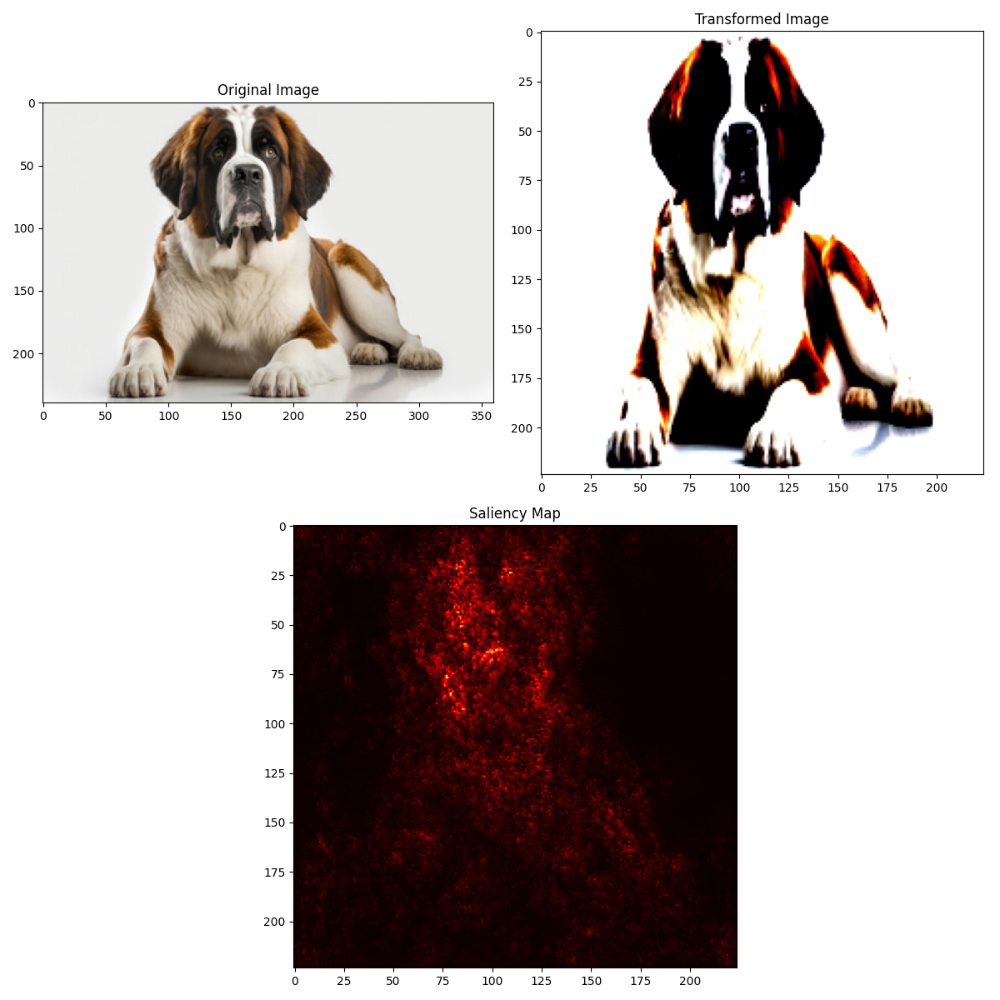
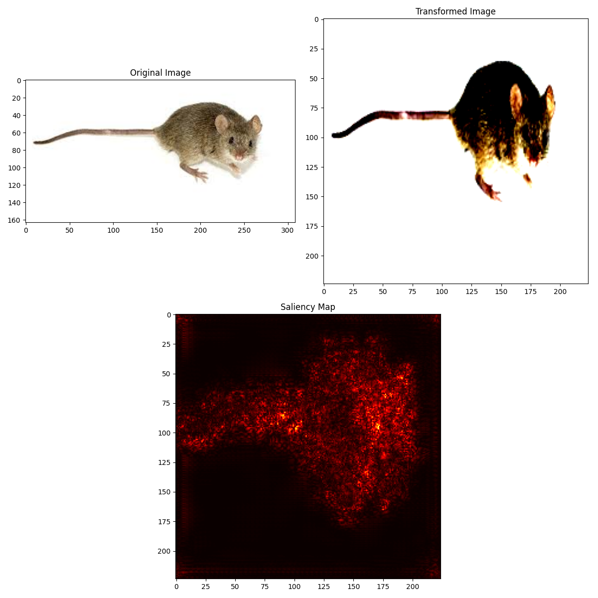
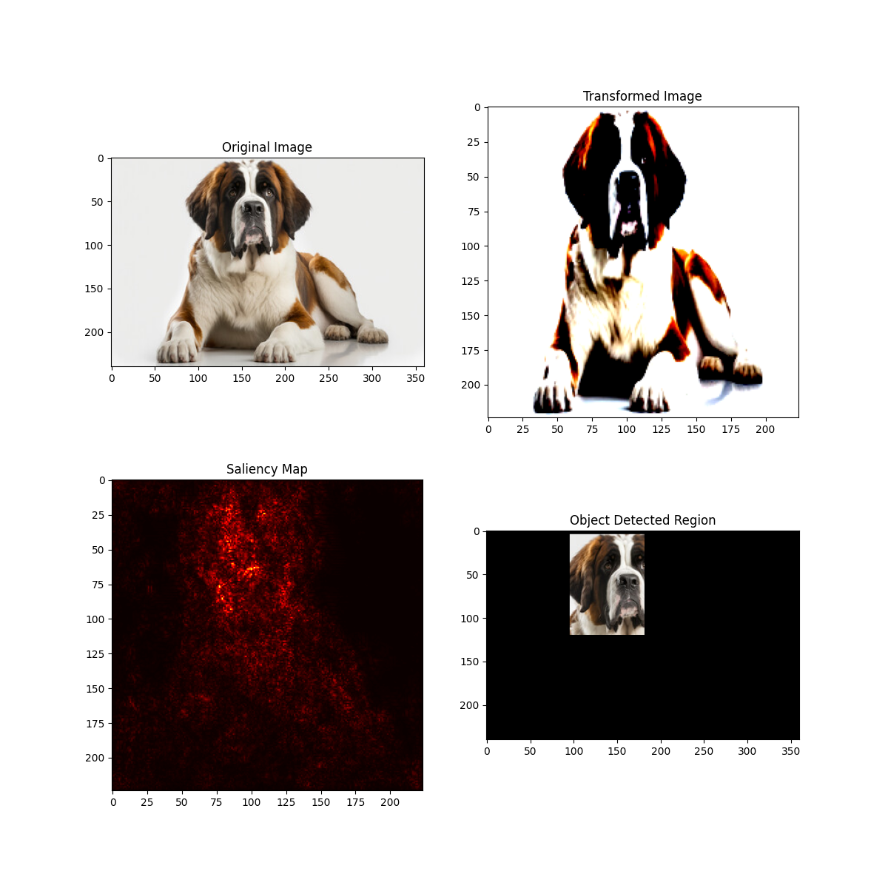
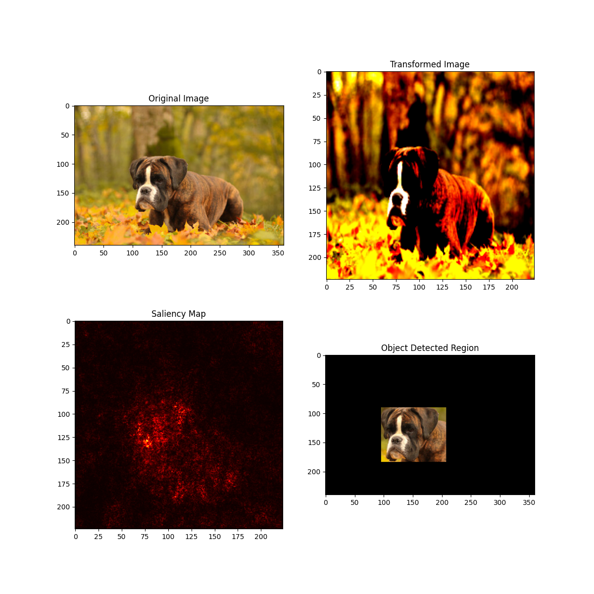
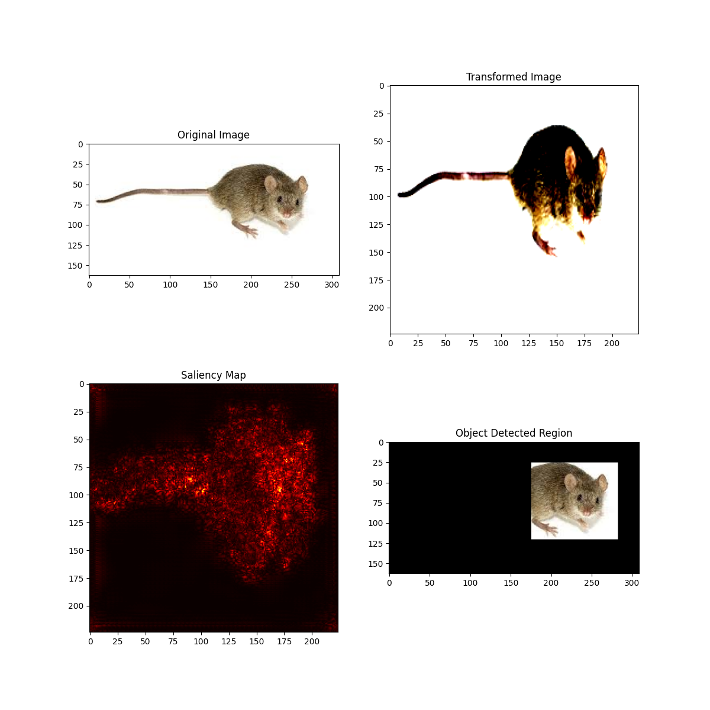

# Occlusion Experiment 
- ## Object Localisation and Image Segmentation using pretrained VGG model

This project focuses on object localization and image segmentation using a pretrained VGG (Visual Geometry Group) model. Object localization involves identifying the location of objects within an image, while image segmentation involves partitioning an image into multiple segments or regions to simplify its analysis.

The VGG model, known for its deep convolutional neural network architecture, is utilized in this project to perform these tasks. By leveraging the pretrained weights of the VGG model, we can achieve high accuracy in identifying and segmenting objects within images without the need for extensive training from scratch.


# Table of Contents

- [Project Title](#occlusion-experiment)
- [Table of Contents](#table-of-contents)
- [Python Packages Used](#python-packages-used)
- [Requirements](#requirements)
- [Usage](#usage)
- [Model Architechture](#model-architechture)
- [Results](#results)


# Python Packages Used
[(Back to top)](#table-of-contents)


- **General Purpose** : General purpose package `Image` for loading jpeg/jpg files into the model.

- **Data Manipulation** : Packages used for handling, importing dataset, creating train-test split, and confusion matrix, such as `numpy` and `cv2`.

- **Data Visualization** : `matplotlib` for data visualization..

- **Machine Learning** : Machine learning package `PyTorch` for The Neural Netowrk, optimisers and loss functions.

# Requirements
[(Back to top)](#table-of-contents)

Assuming the *requirements.txt* file is present on your local directory, run the following command on the command line to install all the dependencies of the Project.

```
pip install -r requirements.txt
```


# Usage
[(Back to top)](#table-of-contents)

To create the Saliency Map, just pass the input image file name and path in the 'final' function to directly obtain results.
```
final("images/image8.jpeg")
```


# Model Architechture
[(Back to top)](#table-of-contents)

**VGG16**:
- Input Layer:(224, 224, 3)
- Convolutional Layers (64 filters, 3×3 filters, same padding):
- Max Pooling Layer (2×2, stride 2):
- Convolutional Layers (128 filters, 3×3 filters, same padding):
- Max Pooling Layer (2×2, stride 2):
- Convolutional Layers (256 filters, 3×3 filters, same padding):
- Convolutional Layers (512 filters, 3×3 filters, same padding):
- Max Pooling Layer (2×2, stride 2):
- Stack of Convolutional Layers and Max Pooling:
- Flattening
- Fully Connected Layers:
  - Three fully connected layers with ReLU activation.
  - First layer with input size 25088 and output size 4096.
  - Second layer with input size 4096 and output size 4096.
  - Third layer with input size 4096 and output size 1000

**Saliency Function**:
- Softmax (over the 1000 class scores produces)
- BackProp this Softmax Class Score with respect to each pixel value

**Optimiser** : Adam Optimiser


# Results
[(Back to top)](#table-of-contents)

Using `matplotlib` , Input image, transformed image(for VGG) and final Saliency Map is plotted.






Also, although this part has not been perfected yet but I am also trying to fit in a box around the 'Object' thus found and labelled in the image.





